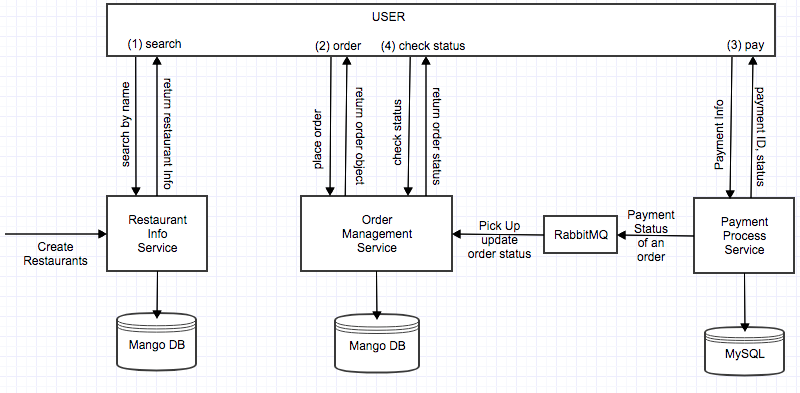

HW2 - Food Delivery

ARCHITECTURE DESIGN:

DESIGN EXPLANATION:
1. Restaurant Info Service: It stores the restaurant info, including restuarnt name, restuarant menu, menu items. It supports the funtionality of inserting new restaurants, and letting user search restaurant by name. When restaurant is found, the restuarant object is returned, which include the all the menu items.
2. Order Management Servie: After user selects the items from a restaurant, user will place order. User sends an Order objects, with items, address, etc to the Order Management Service to create a new order, and some additional order info is returned to user after order is created, including Order ID, Total Price, etc. The User will next go to the payment step. After payment is done, user can send request to Order Mangement Service to check the status of the order. System will respond with latest status, such as whether payment succeed, and the estimated delivery status. Order Management Servie also picks up messages from a RabbitMQ to update the order status based on payment success/fail info passed from Payment Process Service.
3. Payment Process Service: After user creates order and received the order ID and total price, user sends payment info to Payment Process Service which handles the credit card payment. Payment Process Service responds user with Payment ID and Status. It then sends a Message to MQ with the payment status for Order Management Service to pick up and udpate order status based on payment status.

API DESIGN:
1. Restaurant Info Service: http://restaurant-info-service
  - HTTP POST /restaurant
    REQUEST: JSON of all restaurants
    RESPONSE: 201

  - HTTP GET /restaurant/{restaurantName}
    RESPONSE: 200 restaurant with given name

  - HTTP DELETE /purge
    RESPONSE: 200 delete all restaurants

  - HTTP DELETE /purge/{restaurantName}
    RESPONSE: 200 delete given restaurant

2. Order Management Service: http://order-management-service
  - HTTP POST /order
    REQUEST: orderItem
    RESPONSE: 201 orderItem containing orderId, totalPrice

  - HTTP POST /payment/status
    REQUEST: payment processing status from Payment Process Service
    RESPONSE: 204

  - HTTP GET /order/{orderId}
    RESPONSE: 200 orderItem with latest status

  - HTTP DELETE /purge
    RESPONSE: 200 delete all orders

  - HTTP DELETE /purge/{orderId}
    RESPONSE: 200 delete given order

3. Payment Process Service: http://payment-process-service
  - HTTP POST /payment
    REQUEST: payment info with orderId
    RESPONSE: 200 Payment ID

